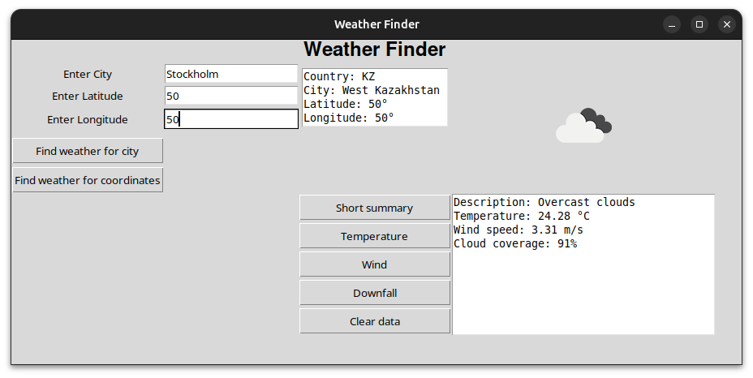

# Weather App


A GUI-based weather application built with `tkinter`. It uses the [OpenWeatherMap API](https://openweathermap.org/api) to fetch real-time weather data from around the world.

## Setup

1. Clone the repository  
   ```bash
   git clone <your-repo-url>
   cd <your-project-directory>
2. Create a `.env` file from `.env.example` and insert your API key. [Openweather website](https://openweathermap.org/api)
3. (a) It's recommended to create a virtual enviroment
    '''bash
    python -m venv venv
    source venv/bin/activate
    '''
3. (b) Install dependencies. 
   ```bash
   pip install -r requirements.txt
   ```

4. Install the app locally (from the root directory)  
   ```bash
   pip install .
   ```

5. Run the application  
   ```bash
   weather-app

